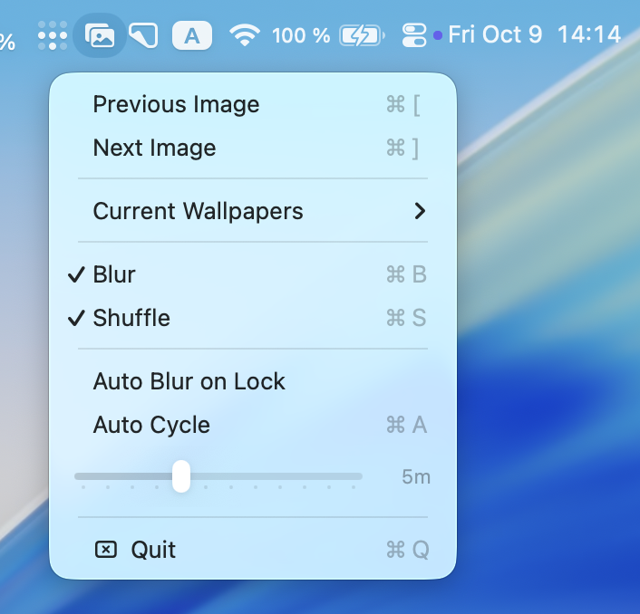

wp is my interpretation of my Android app [Shimmer](@/projects/shimmer/index.md) for macOS. It is a menu app that offers a quite minimal wallpaper switcher. It lets you cycle through your favorite wallpapers on a timeout or with a hotkey. It applies a blur effect and lets you reveal the image with double click on the desktop. 

{{ github_repo(repo="abdusco/wp") }}

It also serves a minimal HTTP server for receiving commands, which you can activate by specifying a `PORT` environment variable. You can use `curl` to send commands to it e.g. with Alfred on a hotkey press.

```bash
PORT=9876 ~/bin/wp ~/Pictures/wallpapers/
curl localhost:9876/next # Next image
curl localhost:9876/prev # Previous image
curl localhost:9876/blur # Toggle blur
```
