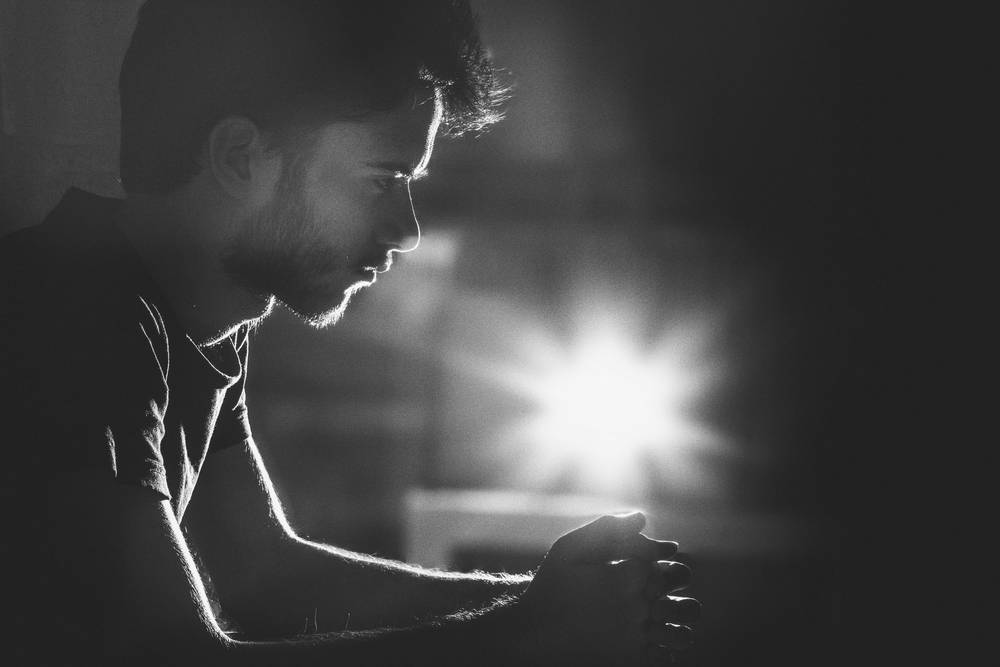

Hey,
My name is Abdussamet Koçak. I'm a developer based in Istanbul, focusing mainly on web, but I also like writing scripts to automate anything and everything. I work as a full-stack web developer and build solutions for clients involving backend, frontend, devops. I can play a role in all phases of actualizing an idea into a product.

I enjoy films, photography and nerding out on science and technology. I love learning a new language and a culture. Tatsächlich lerne ich gern seit 3 Jahren Deutsch selbst und schätze, dass ich um Niveau C1 bin. Ich kann ohne Probleme Deutsch lesen und hören aber meine schriftliche und mündliche Sprachkenntnisse bleiben immer hinter den anderen. Ich mache mir darüber keine Sorge. Ich mag den Verlauf, nicht das Ergebnis.

You can react out to me about anything at [mailto:hey@abdus.dev](hey@abdus.dev). 

