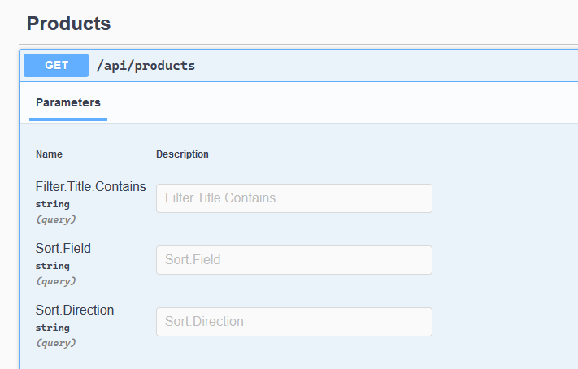
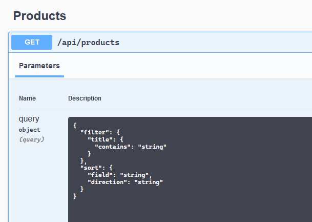

I've been building and an API that supports seaching with complex filters. Think of product filtering you see on most shopping websites, with inputs for price, rating, brand and so on.

By convention, search APIs are exposed from a `GET` endpoint, and take parameters as query strings. Complex nested objects are usually serialized in bracket notation i.e. `?field[subfield]`:

```http
GET /products?
  filter[title][contains]=ssd&
  filter[price][lt]=100&
  sort[field]=price&
  sort[direction]=ASC
```

This is unnecessarily verbose, field path prefixes are repeated multiple times. Not to mention, ASP.NET Core doesn't seem to support this bracketed format for binding complex types.

I prefer querying the API with arguments serialized as JSON. It's more succinct, and also easier for clients to serialize.

```http
GET /products?query=
  {
    "filter": {
      "title": {
        "contains": "ssd"
      },
    },
    "sort": {
      "field": "price",
      "direction": "ASC"
    }
  }
```

Let's say we have a controller action that accepts a `SearchQuery` instance, populated from the query string:

```c#
[HttpGet]
public async Task<ActionResult<SearchResult>> SearchProducts(
    [FromQuery] SearchQuery query
) { ... }
```

When we inspect the OpenAPI / Swagger schema, the action is described as having separate parameters for each property in my query type. 

```json
{
  "paths": {
    "/api/products": {
      "get": {
        "parameters": [
          { "name": "Filter.Title.Contains", "in": "query" /* ... */ },
          { "name": "Sort.Field", "in": "query" /* ... */ },
          { "name": "Sort.Direction", "in": "query" /* ... */ }
        ]
  // ...
}
```

This corresponds to a query string formatted in dot notation `field.subfield`:

```http
GET /products?
  Filter.Title.Contains=ssd&
  Sort.Field=price&
  Sort.Direction=ASC
```

This is rendered as a form with with separate inputs in Swagger UI.



If we try to send the parameter as JSON we can't have it bind to a complex type. `SearchQuery query` parameter is always empty.

We could `POST` this JSON in the request body, but that breaks the convention and doesn't signal that the endpoint is actually idempotent.

## Binding JSON query parameters

We can work around it by accepting a JSON string, then deserializing it inside the action.

```c#
[HttpGet]
public Task<ActionResult<SearchResult>> SearchProducts(
    [FromQuery(Name = "query")] string queryJson
) {
    var query = DeserializeJson(queryJson);
    // ...
}
```

This works, but I don't like parsing, model binding & validation myself that MVC platform already does for me.
It'd be best if we could utilize ASP.NET as much as possible.

MVC gives us a better extension point: model binders. We will use them to create our own binder and use it just like we would with `[FromQuery]`, or `[FromBody]`.

### Creating a custom model binder

We start with subclassing `ModelBinderAttribute`. It's a concrete class, so we don't have to implement anything, but we want to specify that we will be using a custom binder.

```c#
internal class FromJsonQueryAttribute : ModelBinderAttribute
{
    public FromJsonQueryAttribute()
    {
        BinderType = typeof(JsonQueryBinder);
    }
}
```

We can annotate the action parameter with it directly instead of using `[ModelBinder]` attribute:

```c#
public Task<ActionResult<SearchResult>> SearchProducts(
    [FromJsonQuery] ProductySearchQuery query
) { ... }
```

Now let's create the `JsonQueryBinder` class to get it working. It needs to implement `IModelBinder` interface with a single method. The steps we need to take is:


- Get raw JSON from the request
- Turn in into a useful type
- Validate it ([later](#utilizing-asp.net-core's-validation-tools))
- Accept / reject the result

`ModelBindingContext` contains `ValueProvider` for retrieving values from the request, if it's not enough, you can also use `HttpContext` and work the request directly. 

Then we deserialize it with System.Text.Json, which is available for all .NET versions, but you could can't go wrong with Json.NET, either.

```c#
internal class JsonQueryBinder : IModelBinder
{
    private readonly ILogger<JsonQueryBinder> _logger;

    public JsonQueryBinder(ILogger<JsonQueryBinder> logger)
    {
        _logger = logger;
    }

    public Task BindModelAsync(ModelBindingContext bindingContext)
    {
        var value = bindingContext.ValueProvider.GetValue(bindingContext.FieldName).FirstValue;
        if (value == null)
        {
            return Task.CompletedTask;
        }

        try
        {
            var parsed = JsonSerializer.Deserialize(
                value,
                bindingContext.ModelType,
                new JsonSerializerOptions(JsonSerializerDefaults.Web)
            );
            bindingContext.Result = ModelBindingResult.Success(parsed);
        }
        catch (Exception e)
        {
            _logger.LogError(e, "Failed to bind '{FieldName}'", bindingContext.FieldName);
            bindingContext.Result = ModelBindingResult.Failed();
        }

        return Task.CompletedTask;
    }
}
```

Now when we send a request to the endpoint, it works! `SearchQuery query` parameter is filled correctly.

```json
GET /products?query={
  "filter": {
    "title": {
      "contains": "ssd"
    }
  },
  "sort": {
    "field": "price",
    "direction": "ASC"
  }
}
```

But validation doesn't work yet. If I omit a `[Required]` property or pass in a string to boolean, it just fails. We can improve this further.

### Utilizing ASP.NET Core's validation tools

After we've deserialized the the payload, we can let ASP.NET take care of the validation. [`IObjectModelValidator`][IObjectModelValidator] interface gives us the tools to validate an object graph with all its properties and sub types.

We inject it into our binder, and call its `.Validate()` method after deserialization. 

```c#
internal class JsonQueryBinder : IModelBinder
{
    // inject the validator in constructor
    private readonly IObjectModelValidator _validator;
    
    // ...

    public Task BindModelAsync(ModelBindingContext bindingContext)
    {
        // ...
        try
        {
            var parsed = JsonSerializer.Deserialize(value, bindingContext.ModelType,
                new JsonSerializerOptions(JsonSerializerDefaults.Web));
            bindingContext.Result = ModelBindingResult.Success(parsed);

            if (parsed != null)
            {
                _validator.Validate(
                    bindingContext.ActionContext,
                    validationState: bindingContext.ValidationState,
                    prefix: string.Empty,
                    model: parsed
                );
            }
        }
        catch (JsonException e)
        {
            _logger.LogError(e, "Failed to bind parameter '{FieldName}'", bindingContext.FieldName);
            bindingContext.ActionContext.ModelState.TryAddModelError(key: e.Path, exception: e,
                bindingContext.ModelMetadata);
        }
        catch (Exception e) when (e is FormatException || e is OverflowException)
        {
            _logger.LogError(e, "Failed to bind parameter '{FieldName}'", bindingContext.FieldName);
            bindingContext.ActionContext.ModelState.TryAddModelError(string.Empty, e, bindingContext.ModelMetadata);
        }

        return Task.CompletedTask;
    }
}
```

Now if we have this annotated model:

```c#
public record SearchSort(
    [Required] string Field,
    [RegularExpression("ASC|DESC")] string Direction
);
```

sending an invalid JSON returns a nicely formatted HTTP 400 error[^400].

```json
{
  "type": "https://tools.ietf.org/html/rfc7231#section-6.5.1",
  "title": "One or more validation errors occurred.",
  "status": 400,
  "traceId": "00-15833e541708ac49b4829f02c40008d0-4830117fc8dbca43-00",
  "errors": {
    "Sort.Field": [
      "The Field field is required."
    ],
    "Sort.Direction": [
      "The field Direction must match the regular expression 'ASC|DESC'."
    ],
    "q.Sort.Field": [
      "The Field field is required."
    ],
    "q.Sort.Direction": [
      "The field Direction must match the regular expression 'ASC|DESC'."
    ]
  }
}
```

## Adding OpenAPI support

When we've created the `FromJsonQueryAttribute`, its `BindingSource` property is set to [`BindingSource.Custom`][BindingSource.Custom], which prevents Swagger from displaying the parameter properties as individual inputs. 



But still, if we try to send a request using the Swagger UI, it serializes the parameter in bracket notation. To solve this problem, we can provide a custom API description for endpoints with `[FromJsonQuery]` parameters to tell clients to actually serialize the parameter as JSON.

OpenAPI specification [addresses][openapi_json] our exact use-case, and gives us the option to specify a parameter schema with a specific content type like so:

```json
{
  "paths": {
    "/api/products": {
      "get": {
        "parameters": [
          {
            "name": "query",
            "in": "query",
            "content": {
              "application/json": {
                "schema": {
                  "$ref": "#/components/schemas/ProductSearchQuery"
                }
              }
            }
  // ...
}
```

We can fix it by hooking into SwashBuckle with an [operation filter][operation_filter] and modify the generated schema. From there, we correct the parameters annotated with `[FromJsonQuery]` with the right schema.

When writing a plugin for a third party library, I prefer having an extension method to hide the glue code, and keep the hooks as nested private classes.

```c#
internal static class JsonQuerySwaggerGenExtensions
{
    public static SwaggerGenOptions AddJsonQuerySupport(this SwaggerGenOptions options)
    {
        options.OperationFilter<JsonQueryOperationFilter>();
        return options;
    }

    private class JsonQueryOperationFilter : IOperationFilter
    {
        public void Apply(OpenApiOperation operation, OperationFilterContext context)
        {
            var jsonQueryParams = context.ApiDescription.ActionDescriptor.Parameters
                .Where(ad => ad.BindingInfo.BinderType == typeof(JsonQueryBinder))
                .Select(ad => ad.Name)
                .ToList();

            if (!jsonQueryParams.Any())
            {
                return;
            }

            foreach (var p in operation.Parameters.Where(p => jsonQueryParams.Contains(p.Name)))
            {
                // move the schema under application/json content type
                p.Content = new Dictionary<string, OpenApiMediaType>()
                {
                    [MediaTypeNames.Application.Json] = new OpenApiMediaType()
                    {
                        Schema = p.Schema
                    }
                };
                // then clear it
                p.Schema = null;
            }
        }
    }
}
```

Now we can enable the filter in our `Startup` class.

```c#
public void ConfigureServices(IServiceCollection services)
{
    // ...
    services.AddSwaggerGen(c =>
    {
        c.AddJsonQuerySupport();
        // ...
    });
}
```

That's it. With everything together, our API is well-annotated and shows the correct Swagger UI for testing.

Cheers ✌.

## References

- [Model Binding in ASP.NET Core][model_binding]
- [Custom model binder][custom_model_binder]
- [SwashBuckle][swashbuckle]

[model_binding]: https://docs.microsoft.com/en-us/aspnet/core/mvc/models/model-binding?view=aspnetcore-5.0
[custom_model_binder]: https://docs.microsoft.com/en-us/aspnet/core/mvc/advanced/custom-model-binding?view=aspnetcore-5.0#custom-model-binder-sample
[openapi_json]: https://swagger.io/docs/specification/describing-parameters/#schema-vs-content
[apicontroller]: https://docs.microsoft.com/en-us/aspnet/core/web-api/?view=aspnetcore-5.0#apicontroller-attribute
[IObjectModelValidator]: https://github.com/dotnet/aspnetcore/blob/85a6cb07ae2e1adf5a03740f8d40333b7b8e360c/src/Mvc/Mvc.Core/src/ModelBinding/Validation/IObjectModelValidator.cs#L11
[BindingSource.Custom]: https://github.com/dotnet/aspnetcore/blob/85a6cb07ae2e1adf5a03740f8d40333b7b8e360c/src/Mvc/Mvc.Core/src/BindPropertyAttribute.cs#L65
[operation_filter]: https://github.com/domaindrivendev/Swashbuckle.AspNetCore#operation-filters
[swashbuckle]: https://github.com/domaindrivendev/Swashbuckle.AspNetCore

[^400]: You need to annotate your controller with `[ApiController]` attribute to get auto-validation, along with other useful behaviors for APIs. See [docs][apicontroller] for further info.