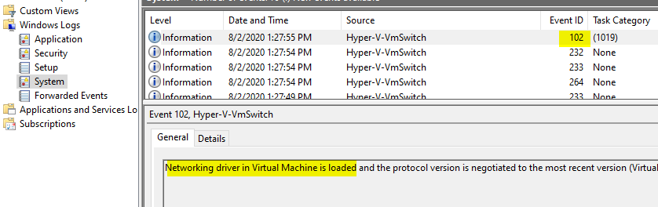

I've been using [WSL][wsl] ever since it came out. It was nice being able to run Linux on Windows without the overhead of VMs. But it had some issues, like not being able to run Docker natively. Microsoft then released a new version called WSL2 which has brought native Docker support. 

One feature of WSL is that it allows sharing IP address space for services listening to [localhost][localhost]. This means one can access servers running on WSL on Windows as if it were running on Windows. This lets us, for instance, access a Docker container listening to `0.0.0.0:8000` on WSL from Windows using `localhost:8000`.

## Problem 

Localhost redirection [often fails][issues] for some reason, such as when PC sleeps and wakes up, and localhost access to Linux services does not work anymore.

## Solution

We can get the internal IP a WSL instance (in my case an Ubuntu distro) has using 

```bash
$ ip -4 addr show eth0
5: eth0: <BROADCAST,MULTICAST,UP,LOWER_UP> mtu 1500 qdisc mq state UP group default qlen 1000
    inet 172.27.106.75/20 brd 172.27.111.255 scope global eth0
       valid_lft forever preferred_lft forever
```

We can see the IP address `172.27.106.75` which we can ping from Windows just fine.

```powershell
PS> ping 172.27.106.75

Pinging 172.27.106.75 with 32 bytes of data:
Reply from 172.27.106.75: bytes=32 time<1ms TTL=64
```

We can run a Python server and reach it from Windows.

```bash
$ python3 -m http.server
Serving HTTP on 0.0.0.0 port 8000 (http://0.0.0.0:8000/) ...
```

```powershell
PS> curl -I http://172.27.106.75:8000
HTTP/1.0 200 OK
...
```

Now we can make the experience better by not having to type in the full IP address everytime we want to access WSL. We can use the [`hosts` file][hosts] for that. But there's a catch: we can't just use `localhost`, because that'd break a lot of systems that rely on `localhost` working as a loopback address. That's why I chose `wsl` as the hostname, you're free to use something else.

For this I've written a PowerShell script that gets the IP address of WSL instance, then creates (or updates) an entry in the `hosts` file.


```powershell
$hostname = "wsl"

# find ip of eth0
$ifconfig = (wsl -- ip -4 addr show eth0)
$ipPattern = "((\d+\.?){4})"
$ip = ([regex]"inet $ipPattern").Match($ifconfig).Groups[1].Value
if (-not $ip) {
    exit
}
Write-Host $ip

$hostsPath = "$env:windir/system32/drivers/etc/hosts"

$hosts = (Get-Content -Path $hostsPath -Raw -ErrorAction Ignore)
if ($null -eq $hosts) {
    $hosts = ""
}
$hosts = $hosts.Trim()

# update or add wsl ip
$find = "$ipPattern\s+$hostname"
$entry = "$ip $hostname"

if ($hosts -match $find) {
    $hosts = $hosts -replace $find, $entry
}
else {
    $hosts = "$hosts`n$entry".Trim()
}

try {
    $temp = "$hostsPath.new"
    New-Item -Path $temp -ItemType File -Force | Out-Null
    Set-Content -Path $temp $hosts

    Move-Item -Path $temp -Destination $hostsPath -Force
}
catch {
    Write-Error "cannot update wsl ip"
}
```

Save this file as `wsl.ps1` and run it as admin to add an entry for WSL in hosts file.

```cmd
powershell -file wsl.ps1
```


## Automating IP renewal

Everytime a WSL instance restarts, it gets a new IP address, so we need to keep the hosts file updated.


```powershell;lines=3,8
PS> wsl -- ip -4 addr show eth0
5: eth0: <BROADCAST,MULTICAST,UP,LOWER_UP> mtu 1500 qdisc mq state UP group default qlen 1000
    inet 172.27.101.9/20 brd 172.27.111.255 scope global eth0
       valid_lft forever preferred_lft forever
PS> wsl --shutdown
PS> wsl -- ip -4 addr show eth0
5: eth0: <BROADCAST,MULTICAST,UP,LOWER_UP> mtu 1500 qdisc mq state UP group default qlen 1000
    inet 172.27.102.184/20 brd 172.27.111.255 scope global eth0
       valid_lft forever preferred_lft forever
```

We can use Scheduled Tasks to monitor WSL events and let it run our script.

Watching new entries Event Viewer under **Windows Logs > System** for **Hyper-V**, we can see a couple of events logged. 



The last entry about loading networking driver seems like a good trigger for our script.

Right click the log and click **Attach Task To This Event** and follow the wizard. Choose **Start a program** as an action and type 

- Program: `powershell.exe`
- Add arguments: `-file c:/path/to/wsl.ps1`

and complete the wizard.

Open Scheduled Tasks and go to **Task Scheduler Library > Event Viewer Tasks**. Find the task we've just created and open its properties.

- In **General** tab, check **Run with highest privileges**. Writing inside `%WINDIR%` requires admin privileges, or the script would fail to run.
- In **Conditions** tab, disable **Start the task only if the computer is on AC power**.

then save the task.

Run the task and check hosts file to see if WSL IP address is added. Also restart WSL instance using:

```powershell
# shutdown
wsl --shutdown
# start
wsl
```
A PowerShell window should pop up and update the IP address.

Now we can access servers running on WSL by `wsl:PORT` when `localhost:PORT` stops working.


[wsl]: https://docs.microsoft.com/en-us/windows/wsl/
[localhost]: https://docs.microsoft.com/en-us/windows/wsl/faq#how-do-i-access-a-port-from-wsl-in-windows
[issues]: https://github.com/microsoft/WSL/issues?q=is%3Aissue+is%3Aopen+localhost
[hosts]: https://en.wikipedia.org/wiki/Hosts_(file)
