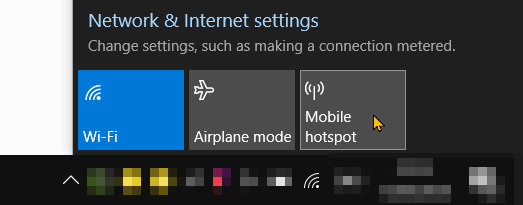

# {{ title }}

There used to be a way to turn on or off hotspot on Windows 7, but it doesn't seem to work well with some wifi adapters
like Intel 9260 wifi card I've installed on my XPS 13. So I cannot control hotspot using `netsh`.

```text
> netsh wlan start hostednetwork

The hosted network couldn't be started.
The group or resource is not in the correct state to perform the requested operation.
```

The only way to control native hotspot was so far using the UI



As of Windows 10 v1607 there's a [new API][api] for UWP apps that we can use to start / stop hotspot tethering in PowerShell:

Here's the script:

```powershell {data-filename=hotspot.ps1}
param (
    [string] $state
)

$connectionProfile = [Windows.Networking.Connectivity.NetworkInformation, Windows.Networking.Connectivity, ContentType = WindowsRuntime]::GetInternetConnectionProfile()
$tetheringManager = [Windows.Networking.NetworkOperators.NetworkOperatorTetheringManager, Windows.Networking.NetworkOperators, ContentType = WindowsRuntime]::CreateFromConnectionProfile($connectionProfile)

if ($state -eq "on") {
    $tetheringManager.StartTetheringAsync() | Out-Null
}
elseif ($state -eq "off") {
    $tetheringManager.StopTetheringAsync() | Out-Null
}
else {
    $tetheringManager.TetheringOperationalState
}
```

Save this as `hotspot.ps1` and run it from PowerShell

```powershell
.\hotspot.ps1 # get the current state (on/off)
.\hotspot.ps1 on
.\hotspot.ps1 off
```
or call it from cmd:

```cmd
powershell -file hotspot.ps1 on 
```


[api]: https://docs.microsoft.com/en-us/uwp/api/windows.networking.networkoperators.networkoperatortetheringmanager