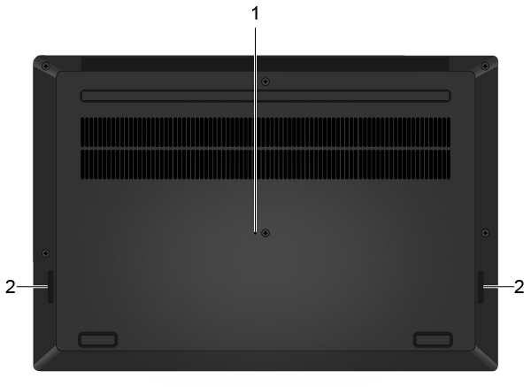

# {{ title }}

Lately I've been using a Lenovo Thinkpad P1 Gen 2, my first, well actually second, ThinkPad.
Today I've depleted the battery completely, then let it hibernate. 
When I plugged the A/C adapter back and pressed the power button, it didn't turn on,
but kept boot-looping. 

I'm documenting this fix in case someone else encounters the same issue.

## Problem
Lenovo Thinkpad P1 Gen 2 doesn't turn on. Keyboard lights up then it resets. Force resetting
 doesn't help.

## Fix
- Remove the A/C adapter.
- Locate the emergency reset hole (#1 on the image below). See the [manual][manual] under **Meet Your Computer > Bottom** heading for reference.  
  
- Find something pointy like a pin/toothpick/paperclip and stick it in the emergency reset hole under the body.
- Turn the PC back on.

I guess it was that easy, 
but I admit that I got flashbacks from trying to fix my old Dell XPS 13. 
Having a hardware reset button is cool. 

[manual]: https://pcsupport.lenovo.com/tr/en/products/laptops-and-netbooks/thinkpad-x-series-laptops/thinkpad-x1-extreme-gen-2/manuals/um922835
