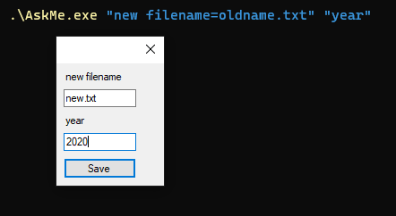

# {{ title }}

askme is a mini application that prompts user questions and prints answers in key-value format to console.
Questions are provided as command arguments as `"question"` or as `"question=default answer"` format.

## Usage

```powershell
askme.exe "new filename=oldname.txt" "year"
```

A dialog should appear with inputs to type answers in:



When saved with clicking the button or hitting `[ENTER]` key, app exits and answers are printed to console as JSON.

```json
{"new filename":"new.txt","year":"2020"}
```

Then this can be consumed from any script by reading stdout and deserialing the JSON.

Hitting `[Esc]` key closes the window and nothing is printed to console.

## Return codes

| Code | Reason |
|-----:|:-------|
|`0`| User submitted the answers|
|`-1`| User cancelled the prompt|
|`1`| Failed to parse questions|


## Download

[Binary files][releases] and [the source code][source] are available on Github.

[releases]: https://github.com/abdusco/askme/releases
[source]: https://github.com/abdusco/askme